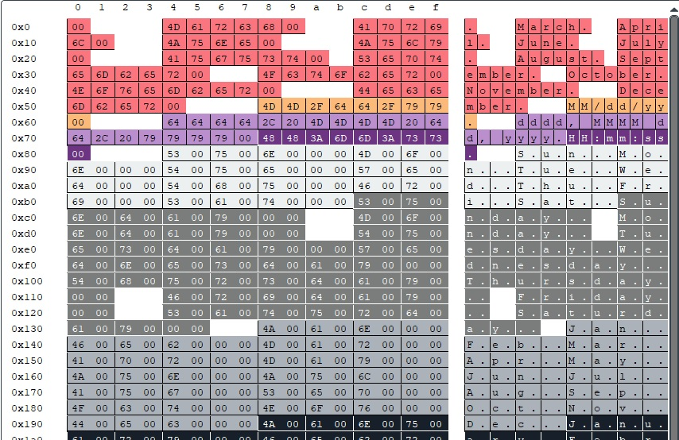

# Data vizualizer plugin

This plugin visualizes data read (or written) from memory. It could be useful when reverse engineering complex file format or protocol.

Each byte is given a color based on where it is read (instruction pointer). So if 2 bytes have same color, they were read on same location and are probably same type of data. You can click the bytes to follow them in trace and see what are they being used for.

# How to use

1. Make a trace of the code which processes the data you are reversing
2. Write down memory address and data size.
3. Open the trace in Execution trace viewer
4. Run this plugin and give the memory address and size when asked

# Requirements

[Python 3.8.1](https://python.org/download)
[Execution Trace Viewer](https://github.com/teemu-l/execution-trace-viewer)
